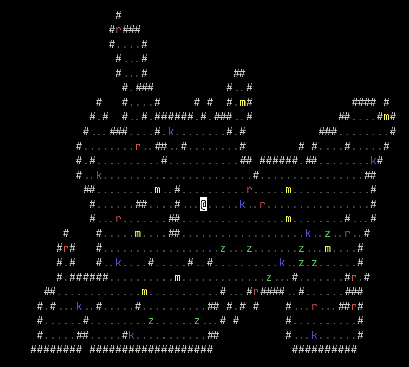

# Dungeon Crawler

A simple text-based dungeon crawler game I'm making for the python class I'm teaching.

### What's changed?
* Refactoring all structure project
* Fixed ANSI-codes rendering on Windows (7,8,10,11) by integrating colorama
